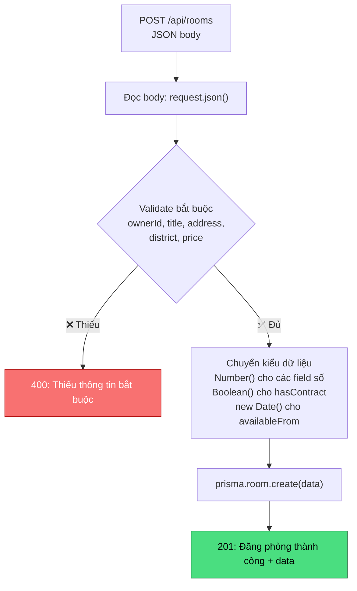
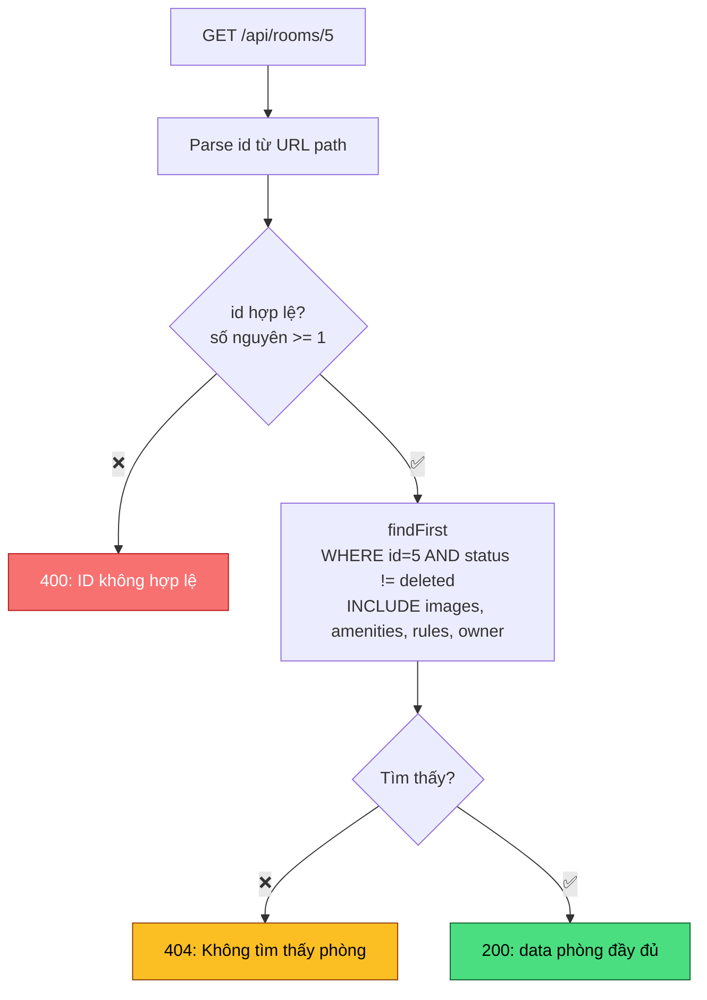
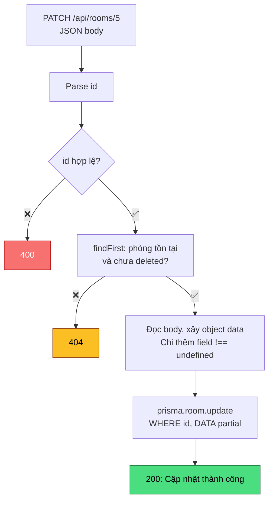
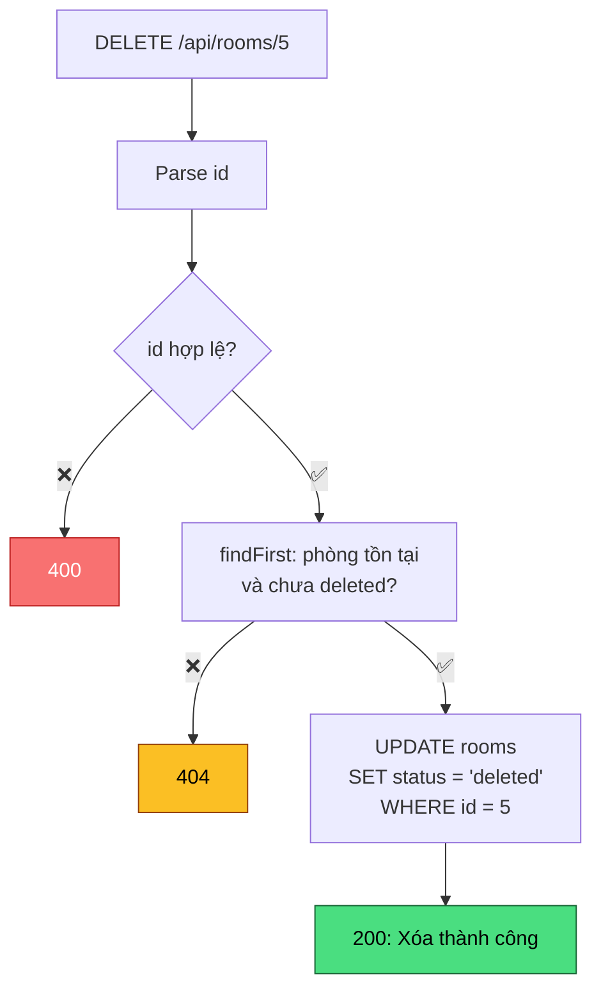
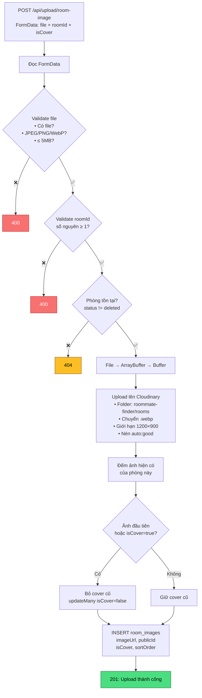

# API Documentation – CRUD cơ bản

## Mục Lục

| # | API | Method | URL |
|---|---|---|---|
| 2 | [Danh sách phòng (lọc + phân trang)](#2-danh-sách-phòng) | GET | `/api/rooms` |
| 3 | [Tạo phòng mới](#3-tạo-phòng-mới) | POST | `/api/rooms` |
| 4 | [Chi tiết phòng](#4-chi-tiết-phòng) | GET | `/api/rooms/:id` |
| 5 | [Cập nhật phòng](#5-cập-nhật-phòng) | PATCH | `/api/rooms/:id` |
| 6 | [Xóa phòng (soft delete)](#6-xóa-phòng) | DELETE | `/api/rooms/:id` |
| 7 | [Upload ảnh phòng](#7-upload-ảnh-phòng) | POST | `/api/upload/room-image` |

---

## Quy Ước Response Chung

Tất cả API trả về JSON với format thống nhất:

**Thành công:**
```json
{
  "success": true,
  "message": "Mô tả (tùy API)",
  "data": { }
}
```

**Thất bại:**
```json
{
  "success": false,
  "message": "Mô tả lỗi"
}
```

**HTTP Status thường gặp:**

| Code | Nghĩa | Khi nào |
|---|---|---|
| 200 | OK | GET, PATCH, DELETE thành công |
| 201 | Created | POST tạo mới thành công |
| 400 | Bad Request | Thiếu/sai tham số |
| 404 | Not Found | Không tìm thấy phòng |
| 500 | Server Error | Lỗi server/database |

---
## 1. Tổng Hợp Nhanh

| API | Method | URL | Body | Dùng cho |
|---|---|---|---|---|
| Danh sách users | GET | `/api/users` | – | Test kết nối |
| Danh sách phòng | GET | `/api/rooms?...` | – | Trang danh sách, tìm kiếm, lọc |
| Tạo phòng | POST | `/api/rooms` | JSON | Form đăng phòng |
| Chi tiết phòng | GET | `/api/rooms/:id` | – | Trang chi tiết phòng |
| Cập nhật phòng | PATCH | `/api/rooms/:id` | JSON (partial) | Form chỉnh sửa phòng |
| Xóa phòng | DELETE | `/api/rooms/:id` | – | Nút xóa phòng |
| Upload ảnh | POST | `/api/upload/room-image` | **FormData** | Form upload ảnh phòng |
## 2. Danh Sách Phòng

### VD: Request

```
GET /api/rooms?district=Thủ Đức&minPrice=2000000&maxPrice=5000000&sort=price_asc&page=1&limit=10
```

### Query Parameters

Tất cả đều **tùy chọn**. Không truyền = không lọc theo tiêu chí đó.

| Param | Kiểu | Mô tả | Ví dụ | Mặc định |
|---|---|---|---|---|
| `district` | string | Lọc theo quận/huyện | `Thủ Đức` | – |
| `ward` | string | Lọc theo phường/xã | `Linh Trung` | – |
| `search` | string | Tìm kiếm trong title, address, district, ward, description | `gần trường` | – |
| `status` | enum | Trạng thái phòng: `draft`, `pending`, `active`, `rented`, `hidden`, `warning` | `active` | Tất cả trừ `deleted` |
| `verificationStatus` | enum | Trạng thái xác thực: `unverified`, `pending`, `verified`, `rejected` | `verified` | – |
| `minPrice` | number | Giá tối thiểu (VNĐ) | `2000000` | – |
| `maxPrice` | number | Giá tối đa (VNĐ) | `5000000` | – |
| `minArea` | number | Diện tích tối thiểu (m²) | `15` | – |
| `maxArea` | number | Diện tích tối đa (m²) | `30` | – |
| `maxPeople` | integer | Số người tối thiểu phòng chứa được | `2` | – |
| `maxRiskScore` | number | Điểm rủi ro tối đa chấp nhận | `10` | – |
| `availableOnly` | string | Chỉ phòng còn chỗ trống | `true` | `false` |
| `sort` | string | Sắp xếp: `newest`, `price_asc`, `price_desc`, `risk_asc`, `area_desc` | `price_asc` | `newest` |
| `page` | integer | Số trang (bắt đầu từ 1) | `1` | `1` |
| `limit` | integer | Số phòng / trang (tối đa 50) | `10` | `12` |

### Ví Dụ Request

```
# Lấy tất cả phòng, mặc định
GET /api/rooms

# Lọc Thủ Đức, giá 2-5 triệu, sắp xếp giá tăng
GET /api/rooms?district=Thủ Đức&minPrice=2000000&maxPrice=5000000&sort=price_asc

# Tìm kiếm từ khóa, chỉ phòng còn chỗ, trang 2
GET /api/rooms?search=gần trường&availableOnly=true&page=2

# Lọc phòng đã xác thực, rủi ro thấp
GET /api/rooms?verificationStatus=verified&maxRiskScore=10&sort=risk_asc
```

### Response 200

```json
{
  "success": true,
  "data": [
    {
      "id": 1,
      "title": "Phòng trọ gần HCMUS cơ sở Linh Trung",
      "address": "12 đường số 4, phường Linh Trung",
      "district": "Thủ Đức",
      "ward": "Linh Trung",
      "price": 2500000,
      "area": "22.00",
      "maxPeople": 2,
      "currentPeople": 1,
      "availableSlots": 1,
      "verificationStatus": "verified",
      "riskScore": 4,
      "status": "active",
      "createdAt": "2026-06-01T...",
      "images": [
        { "imageUrl": "https://res.cloudinary.com/.../linh-trung-cover.webp" }
      ],
      "owner": {
        "id": 2,
        "fullName": "Nguyễn Hoàng Nam",
        "avatarUrl": "https://i.pravatar.cc/150?img=11",
        "reputationScore": "4.80"
      }
    }
  ],
  "pagination": {
    "page": 1,
    "limit": 12,
    "total": 8,
    "totalPages": 1
  }
}
```

### Lỗi Có Thể Gặp

| Status | Khi nào |
|---|---|
| 400 | `status` hoặc `verificationStatus` không nằm trong enum |
| 400 | Tham số số (giá, diện tích, page...) không hợp lệ (chữ, số âm...) |
| 500 | Lỗi server / database |


**Thuật toán lọc:** Xây dựng object `where` một cách **incremental** – bắt đầu từ điều kiện cơ bản (`status != deleted`), rồi thêm từng điều kiện nếu param tương ứng được truyền. Các điều kiện ngang hàng kết hợp bằng AND, riêng `search` dùng OR trên 5 field.

**Thuật toán phân trang:** `skip = (page - 1) * limit`. Dùng `$transaction` để đảm bảo `findMany` và `count` thấy cùng 1 snapshot dữ liệu.

---

## 3. Tạo Phòng Mới

### Request

```
POST /api/rooms
Content-Type: application/json
```

### Body (JSON)

| Field | Kiểu | Bắt buộc | Mô tả | Mặc định |
|---|---|---|---|---|
| `ownerId` | number | ✅ | ID chủ trọ | – |
| `title` | string | ✅ | Tiêu đề phòng | – |
| `address` | string | ✅ | Địa chỉ | – |
| `district` | string | ✅ | Quận/huyện | – |
| `price` | number | ✅ | Giá (VNĐ/tháng) | – |
| `description` | string | ❌ | Mô tả chi tiết | `null` |
| `ward` | string | ❌ | Phường/xã | `null` |
| `deposit` | number | ❌ | Tiền cọc | `0` |
| `area` | number | ❌ | Diện tích (m²) | `null` |
| `electricityFee` | number | ❌ | Phí điện (VNĐ/kWh) | `0` |
| `waterFee` | number | ❌ | Phí nước (VNĐ/tháng) | `0` |
| `wifiFee` | number | ❌ | Phí wifi (VNĐ/tháng) | `0` |
| `parkingFee` | number | ❌ | Phí gửi xe (VNĐ/tháng) | `0` |
| `otherFee` | number | ❌ | Phí khác (VNĐ/tháng) | `0` |
| `maxPeople` | number | ❌ | Số người tối đa | `1` |
| `availableSlots` | number | ❌ | Số chỗ trống | `1` |
| `hasContract` | boolean | ❌ | Có hợp đồng không | `false` |
| `minStayMonths` | number | ❌ | Ở tối thiểu (tháng) | `1` |
| `availableFrom` | string | ❌ | Ngày bắt đầu cho thuê (ISO date) | `null` |

### Ví Dụ Request

```json
{
  "ownerId": 2,
  "title": "Phòng trọ gần ĐH Bách Khoa",
  "description": "Phòng sạch sẽ, có wifi, gần trường",
  "address": "123 đường Lý Thường Kiệt, phường 14",
  "district": "Quận 10",
  "ward": "Phường 14",
  "price": 3500000,
  "deposit": 3500000,
  "area": 25,
  "electricityFee": 3500,
  "waterFee": 100000,
  "wifiFee": 80000,
  "maxPeople": 2,
  "availableSlots": 2,
  "hasContract": true,
  "minStayMonths": 6,
  "availableFrom": "2026-07-01"
}
```

### Response 201

```json
{
  "success": true,
  "message": "Đăng phòng thành công",
  "data": {
    "id": 11,
    "ownerId": 2,
    "title": "Phòng trọ gần ĐH Bách Khoa",
    "status": "pending",
    "verificationStatus": "unverified",
    "riskScore": 0,
    "createdAt": "2026-06-09T..."
  }
}
```

> [!NOTE]
> Phòng mới tạo luôn có `status: "pending"` và `verificationStatus: "unverified"` (giá trị mặc định từ schema). Ảnh phòng upload riêng qua API `/api/upload/room-image`.

### Lỗi Có Thể Gặp

| Status | Khi nào |
|---|---|
| 400 | Thiếu 1 trong 5 field bắt buộc: ownerId, title, address, district, price |
| 500 | ownerId không tồn tại (foreign key lỗi), hoặc lỗi server |

### Luồng Xử Lý



---

## 4. Chi Tiết Phòng

### Request

```
GET /api/rooms/:id
```

| Param | Kiểu | Mô tả | Ví dụ |
|---|---|---|---|
| `id` (URL path) | integer | ID phòng | `/api/rooms/1` |

### Response 200

```json
{
  "success": true,
  "data": {
    "id": 1,
    "ownerId": 2,
    "title": "Phòng trọ gần HCMUS cơ sở Linh Trung",
    "description": "Phòng sạch, an ninh...",
    "address": "12 đường số 4, phường Linh Trung",
    "district": "Thủ Đức",
    "ward": "Linh Trung",
    "latitude": "10.85630000",
    "longitude": "106.77190000",
    "price": 2500000,
    "deposit": 2500000,
    "area": "22.00",
    "electricityFee": 3500,
    "waterFee": 100000,
    "wifiFee": 80000,
    "parkingFee": 100000,
    "otherFee": 0,
    "maxPeople": 2,
    "currentPeople": 1,
    "availableSlots": 1,
    "hasContract": true,
    "minStayMonths": 6,
    "availableFrom": "2026-06-15",
    "verificationStatus": "verified",
    "riskScore": 4,
    "status": "active",
    "createdAt": "2026-06-01T...",
    "updatedAt": "2026-06-01T...",
    "images": [
      {
        "id": 1,
        "roomId": 1,
        "imageUrl": "https://res.cloudinary.com/.../linh-trung-cover.webp",
        "cloudinaryPublicId": "roommate-finder/rooms/linh-trung-cover",
        "isCover": true,
        "sortOrder": 0,
        "createdAt": "2026-06-01T..."
      },
      {
        "id": 2,
        "roomId": 1,
        "imageUrl": "https://res.cloudinary.com/.../linh-trung-gallery-1.webp",
        "cloudinaryPublicId": "roommate-finder/rooms/linh-trung-gallery-1",
        "isCover": false,
        "sortOrder": 1,
        "createdAt": "2026-06-01T..."
      }
    ],
    "amenities": [
      {
        "roomId": 1,
        "amenityId": 1,
        "amenity": { "id": 1, "name": "Wifi", "icon": "wifi" }
      }
    ],
    "rules": {
      "id": 1,
      "roomId": 1,
      "allowSmoking": false,
      "allowPet": false,
      "allowGuest": false,
      "curfewTime": "23:00",
      "cookingAllowed": true,
      "parkingAllowed": true,
      "note": "Giữ yên tĩnh sau 22 giờ."
    },
    "owner": {
      "id": 2,
      "fullName": "Nguyễn Hoàng Nam",
      "phone": "0901000001",
      "avatarUrl": "https://i.pravatar.cc/150?img=11",
      "reputationScore": "4.80"
    }
  }
}
```

> [!NOTE]
> **Khác với API danh sách:** API chi tiết trả về **tất cả thông tin** bao gồm description, tọa độ, phí chi tiết, **toàn bộ ảnh** (sắp xếp theo sortOrder), tiện ích, nội quy, và **số điện thoại** chủ trọ.

### Lỗi Có Thể Gặp

| Status | Khi nào |
|---|---|
| 400 | `id` không phải số nguyên dương |
| 404 | Phòng không tồn tại hoặc đã bị xóa mềm |
| 500 | Lỗi server |

### Luồng Xử Lý



**Dữ liệu include:** Dùng `include` (không phải `select`) nên trả về **toàn bộ field** của room + JOIN 4 bảng liên quan. Ảnh sắp xếp theo `sortOrder ASC` (ảnh bìa trước, gallery sau).

---

## 5. Cập Nhật Phòng

### Request

```
PATCH /api/rooms/:id
Content-Type: application/json
```

### Body (JSON) – Partial Update

Chỉ cần gửi **các field muốn thay đổi**. Không gửi = giữ nguyên.

| Field | Kiểu | Mô tả |
|---|---|---|
| `title` | string | Tiêu đề |
| `description` | string | Mô tả |
| `address` | string | Địa chỉ |
| `district` | string | Quận |
| `ward` | string | Phường |
| `price` | number | Giá |
| `deposit` | number | Tiền cọc |
| `area` | number | Diện tích |
| `electricityFee` | number | Phí điện |
| `waterFee` | number | Phí nước |
| `wifiFee` | number | Phí wifi |
| `parkingFee` | number | Phí gửi xe |
| `otherFee` | number | Phí khác |
| `maxPeople` | number | Số người tối đa |
| `currentPeople` | number | Số người hiện tại |
| `availableSlots` | number | Số chỗ trống |
| `hasContract` | boolean | Có hợp đồng |
| `minStayMonths` | number | Ở tối thiểu (tháng) |
| `availableFrom` | string \| null | Ngày bắt đầu (ISO date hoặc null) |

### Ví Dụ Request – Chỉ đổi giá và mô tả

```
PATCH /api/rooms/1
```
```json
{
  "price": 2800000,
  "description": "Phòng mới sơn lại, thêm máy lạnh"
}
```

### Response 200

```json
{
  "success": true,
  "message": "Cập nhật phòng thành công",
  "data": {
    "id": 1,
    "title": "Phòng trọ gần HCMUS cơ sở Linh Trung",
    "price": 2800000,
    "description": "Phòng mới sơn lại, thêm máy lạnh",
    "updatedAt": "2026-06-09T..."
  }
}
```

### Lỗi Có Thể Gặp

| Status | Khi nào |
|---|---|
| 400 | `id` không phải số nguyên dương |
| 404 | Phòng không tồn tại hoặc đã bị xóa mềm |
| 500 | Lỗi server |

### Luồng Xử Lý



**Thuật toán Partial Update:** Duyệt từng field trong body – nếu `!== undefined` thì thêm vào object `data`. Prisma chỉ cập nhật các field có trong `data`, field không có giữ nguyên. Đây là lý do dùng PATCH (cập nhật 1 phần) chứ không phải PUT (thay thế toàn bộ).

---

## 6. Xóa Phòng

### Request

```
DELETE /api/rooms/:id
```

### Response 200

```json
{
  "success": true,
  "message": "Xóa phòng thành công"
}
```

### Lỗi Có Thể Gặp

| Status | Khi nào |
|---|---|
| 400 | `id` không phải số nguyên dương |
| 404 | Phòng không tồn tại hoặc đã bị xóa mềm rồi |
| 500 | Lỗi server |

### Luồng Xử Lý



> [!IMPORTANT]
> **Đây là Soft Delete** – chỉ đổi `status` thành `"deleted"`, KHÔNG xóa dòng khỏi database. Phòng bị xóa mềm sẽ không hiện trong danh sách (GET /api/rooms đã lọc `status != deleted`) nhưng dữ liệu vẫn tồn tại trong DB. Ảnh trên Cloudinary cũng không bị xóa.

---

## 7. Upload Ảnh Phòng

### Request

```
POST /api/upload/room-image
Content-Type: multipart/form-data
```

> [!WARNING]
> API này dùng **`form-data`** (không phải JSON) vì có gửi file ảnh.

### Form Data Fields

| Field | Kiểu | Bắt buộc | Mô tả | Ví dụ |
|---|---|---|---|---|
| `file` | **File** | ✅ | File ảnh (JPEG, PNG, WebP). Tối đa 5MB | Chọn file từ máy |
| `roomId` | Text | ✅ | ID phòng muốn gắn ảnh | `1` |
| `isCover` | Text | ❌ | Đặt làm ảnh bìa? | `true` hoặc `false` |

### Cách gửi trong Postman

```
Method: POST
URL: http://localhost:3000/api/upload/room-image
Body tab → chọn "form-data":

┌──────────┬──────────┬──────────────────────┐
│ KEY      │ TYPE     │ VALUE                │
├──────────┼──────────┼──────────────────────┤
│ file     │ File     │ [chọn ảnh từ máy]    │
│ roomId   │ Text     │ 1                    │
│ isCover  │ Text     │ true                 │
└──────────┴──────────┴──────────────────────┘
```

### Cách gửi trong Frontend (JavaScript)

```javascript
const formData = new FormData();
formData.append("file", fileInput.files[0]);  // File từ <input type="file">
formData.append("roomId", "1");
formData.append("isCover", "true");

const response = await fetch("/api/upload/room-image", {
  method: "POST",
  body: formData,
  // ⚠️ KHÔNG set Content-Type header – browser tự thêm boundary
});

const json = await response.json();
```

### Response 201

```json
{
  "success": true,
  "message": "Upload ảnh thành công",
  "data": {
    "id": 21,
    "roomId": 1,
    "imageUrl": "https://res.cloudinary.com/dxtavkgyh/image/upload/v1234/roommate-finder/rooms/abc123.webp",
    "cloudinaryPublicId": "roommate-finder/rooms/abc123",
    "isCover": true,
    "sortOrder": 0,
    "createdAt": "2026-06-09T..."
  }
}
```

### Lỗi Có Thể Gặp

| Status | message | Khi nào |
|---|---|---|
| 400 | Chưa chọn file ảnh | Không gửi field `file` hoặc gửi text thay vì file |
| 400 | Chỉ chấp nhận ảnh JPEG, PNG hoặc WebP | File type không hợp lệ (.pdf, .gif...) |
| 400 | Ảnh không được vượt quá 5MB | File quá lớn |
| 400 | ID phòng không hợp lệ | roomId không phải số nguyên dương |
| 404 | Không tìm thấy phòng | roomId không tồn tại hoặc phòng đã xóa mềm |
| 500 | Lỗi khi upload ảnh | Cloudinary lỗi, database lỗi, hoặc lỗi server |

### Luồng Xử Lý



**Xử lý ảnh trên Cloudinary:**
- Tự động chuyển sang format `.webp` (nhẹ hơn JPEG/PNG 25-35%)
- Thu nhỏ ảnh xuống tối đa 1200×900 pixel (nếu ảnh lớn hơn)
- Nén chất lượng tự động (`auto:good`)

**Logic ảnh bìa (isCover):**
- Ảnh đầu tiên upload cho phòng → **tự động là cover** (bất kể isCover truyền gì)
- Ảnh tiếp theo: nếu `isCover=true` → bỏ cover cũ, đặt ảnh mới làm cover
- Mỗi phòng luôn có **đúng 1 ảnh bìa**

**Logic sortOrder:** `sortOrder = số ảnh hiện có`. Ảnh mới luôn đứng cuối danh sách. Ảnh đầu tiên = 0, ảnh thứ 2 = 1, thứ 3 = 2...


